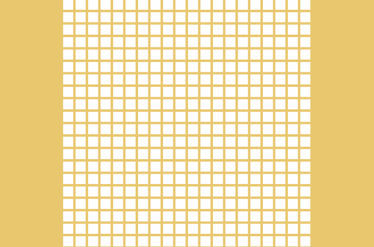
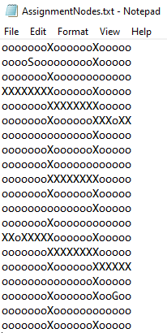
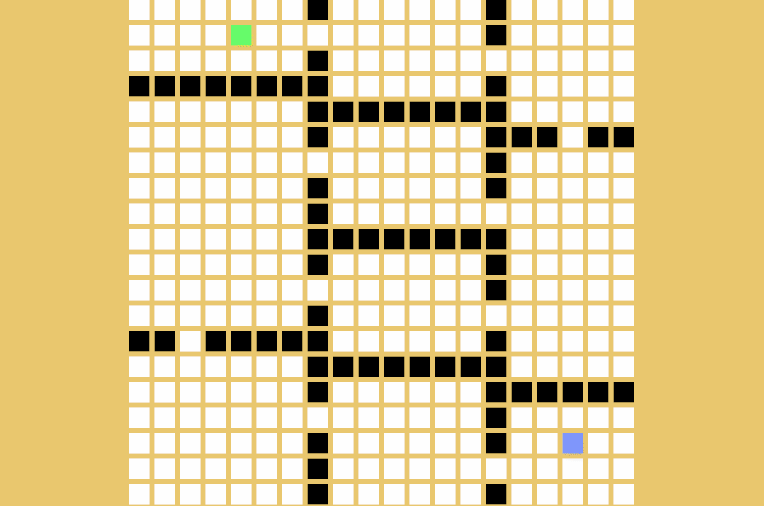

# DSA Graph Visual

I made a simple graph editor to visualize the pathfinding and measuring time-consuming for different algorithms, including DFS, BFS, and A*.

This graph editor has 2 painting modes:

1. Walls, left-click to paint walls (black nodes), and right-click to remove.
2. Start/End, left click to set the start position (green node) and right-click to set the end position (blue node).

To Switch between these two modes, press Tab

This editor can also receive a txt file as the input for initialization.

Once the start node and end node are set, you can press D, B or A to get a path from the start to the end generated by DFS, BFS and A* respectively. 

Press C to clear the path from the graph.

The gray nodes are the nodes been visited by the path finding algorithm but not been included with the final path.